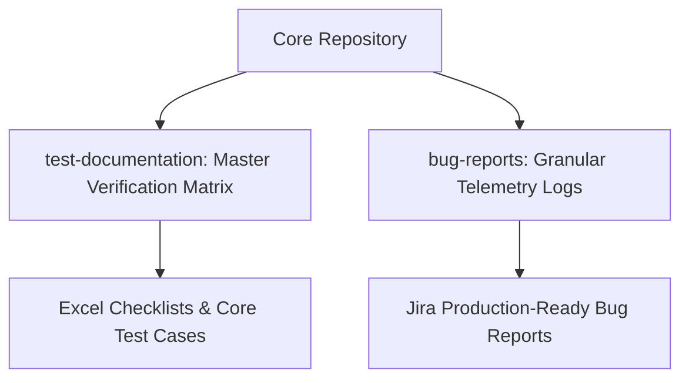

# 🚗 Urban Routes - Web Functional & Structural Testing Suite

[](#)
[](#)
[](#)

*Read this document in other languages: [Español (Spanish)](./README_ES.md)*

---

## 📋 Project Overview
This repository contains the comprehensive **Core Verification Suite** and functional validation architecture executed on the **Urban Routes Car-Sharing component**. The primary objective was to deploy advanced black-box testing methodologies to validate user interface design layout convergence, end-to-end transactional logic, and cross-browser behavioral stability across highly dynamic modules.

---

## 🛠️ Testing Methodologies & Engineering Techniques

Throughout the test case design and validation phase, advanced QA techniques were applied to guarantee maximum boundary coverage and minimize execution redundancy:

* **Equivalence Class Partitioning (ECP):** Segregated input domains for payment verification profiles (e.g., card length constraints, custom dynamic formatting rules).
* **Boundary Value Analysis (BVA):** Applied precise verification constraints on numeric inputs (CVV range validation limits, edge-case cardholder text boundaries).
* **Defect Lifecycle Management:** Programmatic ingestion of dynamic defects directly translated into structural Jira defect tickets linked with comprehensive clear-cut replication telemetry.

---

## 📐 Test Architecture & Repository Structure



* 📁 `test-documentation/`: Houses the master validation artifact (`.xlsx`), structuring execution tracking logs split into targeted coverage scopes:
  * **Design Checklist:** 54+ granular responsive layout and typographic check verification nodes.
  * **Payment Module:** Structural matrix for card onboarding workflow validation rules.
  * **Reservation System:** Explicit functional testing conditions covering positive, negative, and blocked behavioral states.
* 📁 `bug-reports/`: Historical registry containing localized replication steps, environmental variables, and severity definitions.
* 🛡️ `.gitignore`: Custom configuration preventing environmental telemetry, local IDE footprints (`.idea`), and binary locks from polluting the upstream remote.

---

## 🖥️ Target Validation Environments

Cross-browser verification matrices were established across contrasting display viewport standards to isolate rendering inconsistencies:

| Environment / Engine | Viewport Specification | Scope / Verification Focus |
| :--- | :--- | :--- |
| **Google Chrome** | `800x600 px` | Core UI Grid Layout & Responsive Boundary Shifts |
| **Mozilla Firefox** | `1920x1080 px` | High-Definition End-to-End Functional Transactional Flow |

---

## 🚀 Execution & Tracking Standard

All verification artifacts deploy industry-standard structural tracking metadata keys:
* **ID Mapping:** Traceable unique node identifiers.
* **Preconditions:** Strict state prerequisites before executing specific validation loops.
* **Defect Synchronization:** Immediate linkage to active Jira tracking lines on functional validation failures.

```bash
# To review execution tracking matrices, examine the latest release within the tracking directory:
cd test-documentation/
```
