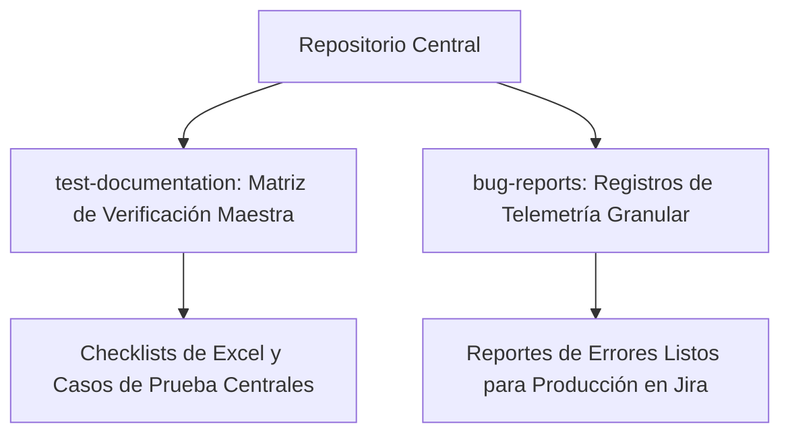

# 🚗 Urban Routes - Suite de Pruebas Estructurales y Funcionales Web

[](#)
[](#)
[](#)

*Read this document in other languages: [English (Inglés)](./README.md)*

---

## 📋 Descripción del Proyecto
Este repositorio contiene la **Suite de Verificación Integral** y la arquitectura de validación funcional ejecutada sobre el componente de **Car-Sharing de Urban Routes**. El objetivo principal fue desplegar metodologías avanzadas de pruebas de caja negra para validar la convergencia del diseño de la interfaz de usuario, la lógica transaccional de extremo a extremo y la estabilidad del comportamiento en diferentes navegadores en módulos altamente dinámicos.

---

## 🛠️ Metodologías de Prueba y Técnicas de Ingeniería

Durante la fase de diseño de casos de prueba y validación, se aplicaron técnicas avanzadas de QA para garantizar la máxima cobertura de límites y minimizar la redundancia de ejecución:

* **Partición de Clases de Equivalencia (ECP):** Dominios de entrada segregados para los perfiles de verificación de pagos (por ejemplo, restricciones de longitud de tarjeta, reglas de formato dinámico personalizadas).
* **Análisis de Valores Límite (BVA):** Aplicación de restricciones de verificación precisas en entradas numéricas (límites de validación de rango de CVV, límites de texto de titulares de tarjetas de casos límite).
* **Gestión del Ciclo de Vida de Defectos:** Registro programático de defectos dinámicos traducidos directamente en tickets de defectos estructurales de Jira vinculados con telemetría de replicación clara.

---

## 📐 Arquitectura de Pruebas y Estructura del Repositorio



* 📁 `test-documentation/`: Alberga el artefacto de validación maestro (`.xlsx`), estructurando los registros de seguimiento de ejecución divididos en alcances de cobertura específicos:
  * **Checklist de Diseño:** Más de 54 nodos de verificación de diseño responsivo y tipografía.
  * **Módulo de Pago:** Matriz estructural para las reglas de validación del flujo de registro de tarjetas.
  * **Sistema de Reservas:** Condiciones explícitas de prueba funcional que cubren estados de comportamiento positivos, negativos y bloqueados.
* 📁 `bug-reports/`: Registro histórico que contiene pasos de replicación localizados, variables de entorno y definiciones de severidad.
* 🛡️ `.gitignore`: Configuración personalizada que evita que la telemetría del entorno, las huellas locales del IDE (`.idea`) y los bloqueos binarios contaminen el repositorio remoto.

---

## 🖥️ Entornos de Validación Destino

Se establecieron matrices de verificación en diferentes navegadores bajo estándares de resolución de pantalla opuestos para aislar inconsistencias de renderizado:

| Entorno / Motor | Especificación de Resolución | Enfoque / Alcance de Verificación |
| :--- | :--- | :--- |
| **Google Chrome** | `800x600 px` | Maquetación de la Interfaz de Usuario y Límites Responsivos |
| **Mozilla Firefox** | `1920x1080 px` | Flujo Transaccional Funcional de Extremo a Extremo en Alta Definición |

---

## 🚀 Estándar de Ejecución y Seguimiento

Todos los artefactos de verificación despliegan claves de metadatos de seguimiento estructural estándar de la industria:
* **Mapeo de IDs:** Identificadores únicos y trazables para cada caso de prueba.
* **Precondiciones:** Requisitos previos de estado obligatorios antes de ejecutar bucles de validación específicos.
* **Sincronización de Defectos:** Vinculación inmediata a líneas de seguimiento activas en Jira (ID de error) ante fallas en la validación funcional.

```bash
# Para revisar las matrices de seguimiento de ejecución, examine el último lanzamiento dentro de la carpeta:
cd test-documentation/
```
